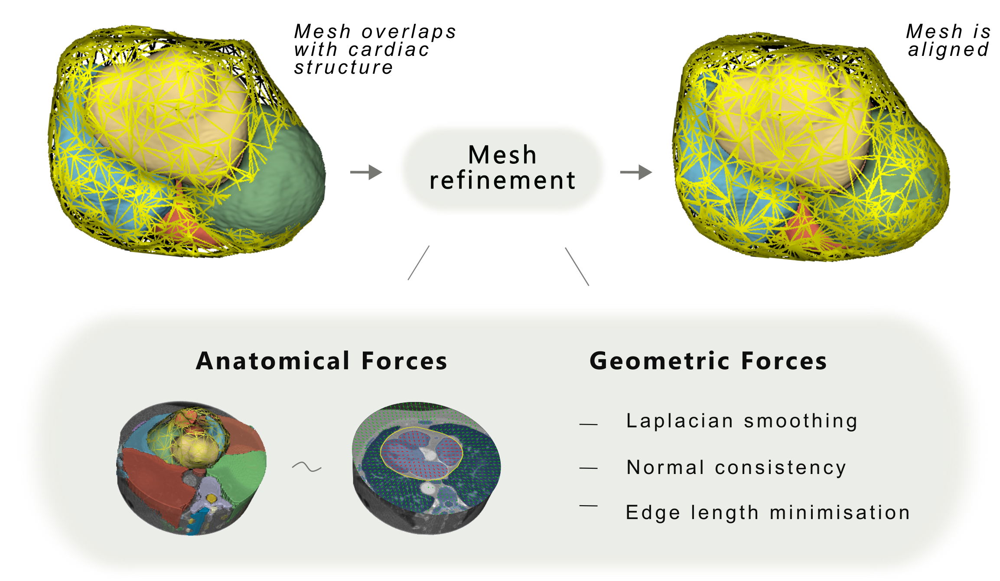

# Anatomy-Aware 3D Mesh Refinement of Pericardium Segmentations

This repository contains the code for the paper:

> **Anatomy-Aware 3D Mesh Refinement of Pericardium Segmentations on Computed Tomography**
> Andreas W. Aspe, Jonas Jalili Pedersen, Michael Huy Cuong Pham, Andreas Ohrt Johansen, Jørgen Tobias Kühl, Klaus Fuglsang Kofoed, Kristine Aavild Sørensen, Rasmus R. Paulsen, Josefine Vilsbøll Sundgaard
> *MIUA 2026*



*The initial pericardium mesh is refined by combining anatomical forces - derived from neighbouring organ masks - with geometric forces (Laplacian smoothing, normal consistency, and edge length minimisation). Internal structures push the mesh outward; external structures push it inward. The result is an anatomically plausible mesh that no longer intersects other anatomical structures.*

---

The following steps walk through downloading, preprocessing, segmenting, and refining meshes from the open-source SAROS dataset using TotalSegmentator and PyTorch3D.

## 1. Installation

### 1.1 Pytorch3d

Installing PyTorch3D can be tricky due to strict compatibility requirements between Python, CUDA, and PyTorch.

First, choose a CUDA version compatible with your GPU. Then install a matching PyTorch build for that CUDA version by following the guide in [Pytorch](https://pytorch.org/).

Next, install a PyTorch3D version that matches both your Python and CUDA versions. Precompiled wheels are available here:
[PyTorch3D wheels](https://miropsota.github.io/torch_packages_builder/pytorch3d/).

### Naming convention

- `cuXXX` → CUDA version (e.g., `cu128` = CUDA 12.8)  
- `cpXXX` → Python version (e.g., `cp313` = Python 3.13)

Download the wheel that matches your setup and install it as described here:  
[torch_packages_builder GitHub](https://github.com/MiroPsota/torch_packages_builder).

In this project, we use Python 3.13.0 and CUDA 12.8 (tested on an NVIDIA RTX PRO 6000 Blackwell Workstation Edition GPU):

```
conda create -n pyt3d python=3.13.0
conda activate pyt3d
pip install torch==2.7.0 torchvision==0.22.0 torchaudio==2.7.0 --index-url https://download.pytorch.org/whl/cu128
pip install --extra-index-url https://miropsota.github.io/torch_packages_builder pytorch3d-0.7.9+pt2.7.0cu128-cp313-cp313-linux_x86_64.whl
```

### 1.2 Other dependencies

---

## 2. Download SAROS dataset

Download the SAROS dataset following the official instructions:

https://github.com/UMEssen/saros-dataset

---

## 3. Run TotalSegmentator

Run TotalSegmentator on the CT images using the following classes:

- heartchambers
- total
- trunkcavities
- coronaryarteries

Place the outputs into the corresponding case folders inside the SAROS dataset directory.

After processing, the dataset structure should look like:

```
saros_dataset/
├── case_000/
│   ├── image.nii.gz
│   ├── body-regions.nii.gz
│   ├── body-parts.nii.gz
│   ├── case_000_coronaryarteries.nii.gz
│   ├── case_000_heartchambershighres.nii.gz
│   ├── case_000_total.nii.gz
│   ├── case_000_trunkcavities.nii.gz
├── case_001/
├── ...
```

---

## 4. Preprocessing Pipeline

```bash
python prepare_saros_data.py
```

This script:
- Filters cases
- Keeps only scans where the heart is visible
- Crops volumes accordingly
- Renames and reorganises files into a clean structure
- Reorients all volumes to the LPS (Left-Posterior-Superior) coordinate system


## 5. Mesh Refinement

Run the refinement stage:

```bash
python run_refinement.py
```

This performs the actual 3D mesh refinement using the preprocessed SAROS data.

---

## 6. Evaluation

### 6.1 Compute metrics

```bash
python metrics_saros.py calculate
```

### 6.2 Summarise results

```bash
python metrics_saros.py summarize --csv-path /data/awias/periseg/saros/TS_pericardium/pytorch3d/metrics/best_grid_search_result_EXCLUDEGRID_EAT0/metrics_summary_taubin.csv
```

This generates aggregated performance metrics across the dataset.

---

## Additional Information

### Hyperparameters

Hyperparameters used for mesh refinement on the CGPS and SAROS datasets.
Both datasets employ the same three-phase optimization schedule and vector-field
formulation, but differ in regularization strength and learning rate to account
for different initial mesh configurations due to different image resolutions.

| **Parameter** | **CGPS** | **SAROS** |
|:---|:---:|:---:|
| ***Optimization schedule*** | | |
| Phase 1 iterations (vector-field dominant) | 1000 | 1000 |
| Phase 2 iterations (smooth blending) | 500 | 500 |
| Phase 3 iterations (regularization-only) | 500 | 500 |
| Total iterations | 2000 | 2000 |
| Initial learning rate | $10^{-3}$ | $10^{-4}$ |
| Minimum learning rate | $10^{-6}$ | $10^{-6}$ |
| Gradient clipping norm | 1.0 | 1.0 |
| Weight decay | 0.002 | 0.002 |
| ***Loss weights — Phase 1*** | | |
| Edge loss weight ($\lambda_{E}$) | 1.0 | 0.001 |
| Laplacian loss weight ($\lambda_{L}$) | 1.0 | 0.01 |
| Normal consistency weight ($\lambda_{N}$) | 0.001 | 0.001 |
| Internal vector field weight ($\lambda_{\text{vf-in}}$) | 10 | 1.0 |
| External vector field weight ($\lambda_{\text{vf-ex}}$) | 0.35 | 0.35 |
| ***Loss weights — Phase 3*** | | |
| Edge loss weight ($\lambda_{E}$) | 2.0 | 0.001 |
| Laplacian loss weight ($\lambda_{L}$) | 2.0 | 0.02 |
| Normal consistency weight ($\lambda_{N}$) | 0.1 | 0.1 |
| Internal vector field weight ($\lambda_{\text{vf-in}}$) | 10.0 | 1.0 |
| External vector field weight ($\lambda_{\text{vf-ex}}$) | 0.35 | 0.35 |
| ***Other settings*** | | |
| Laplacian type | Uniform | Cotangent |
| Taubin smoothing iterations | 50 | 50 |
| Taubin parameters $(\lambda, \mu)$ | $(0.5, -0.53)$ | $(0.5, -0.53)$ |

### Anatomical references for creation of vector field

Several structures from different tasks from TotalSegmentator was utilized to compute the internal and external vector fields. Specifically we utilised the classes \textit{total}, \textit{heartchambers\_higres} and \textit{coronary\_arteries}. For each class we went through each of the organs, represented with individual labels, to define, whether they belong internally and externally to the pericardium. The table below presents an overview of this anatomical division. Note that some structures were excluded from the analysis (indicated by the dash), as no general rule defines them as strictly internal or external, or they are already covered by another class.

| **Class** | **Label(s)** | **Structure(s)** | **Category** |
|:---|:---|:---|:---:|
| *total* | 61 | atrial_appendage_left | Internal |
| *total* | 1–50, 54–60, 64–117 | All remaining structures | External |
| *total* | 51, 52, 53, 62, 63 | heart, aorta, pulmonary_vein, superior_vena_cava, inferior_vena_cava | - |
| *heartchambers_highres* | 1–5 | myocardium, atria, ventricles | Internal |
| *heartchambers_highres* | 6-7 | aorta, pulmonary_artery  | - |
| *coronary_arteries* | 1 | coronary_arteries | Internal |

---

## To Do

- Make a little better format of paths and such in the `run_refinement.py` script
- Improve the summary script
